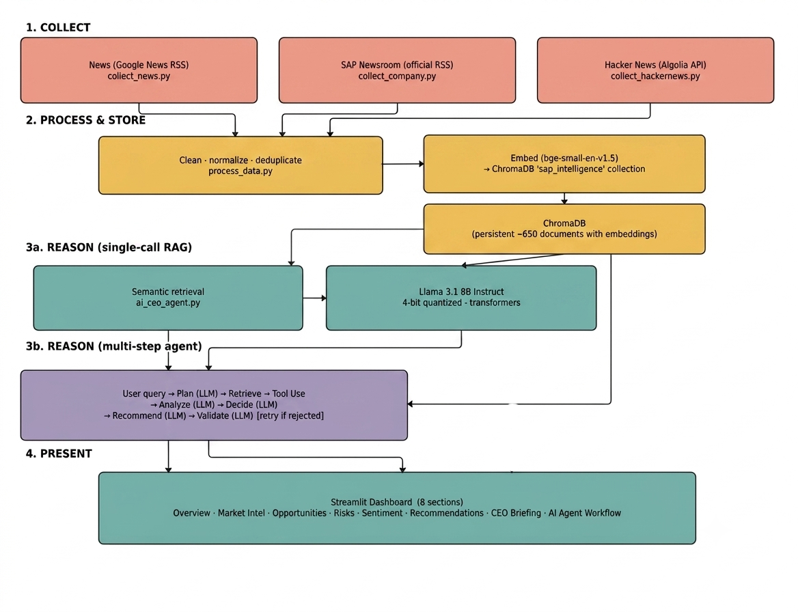
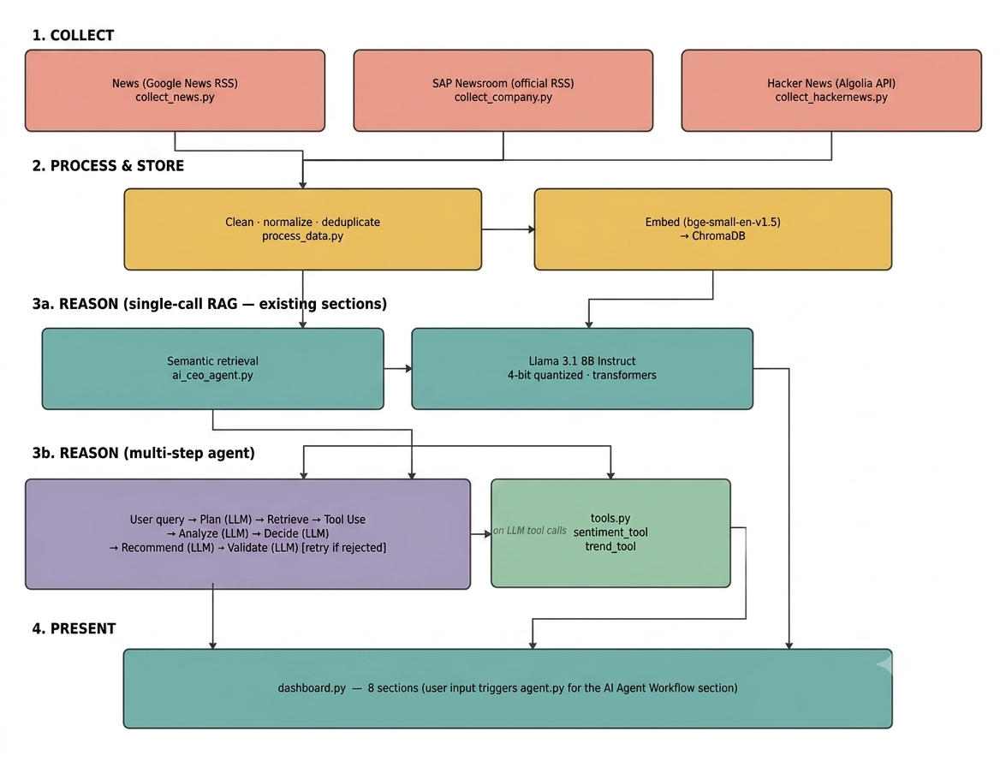
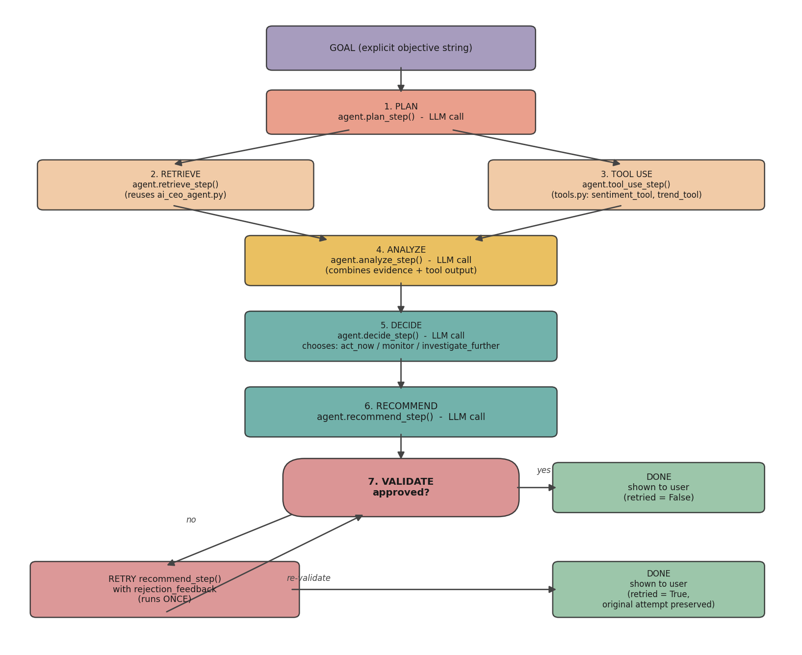

# AI CEO: Strategic Intelligence Agent — SAP

An AI-powered Strategic Intelligence Agent that collects live information about SAP from multiple public sources, stores and reasons over it using a local open-source LLM, and presents executive-level recommendations through an interactive dashboard — including a multi-step AI agent that receives user queries and dynamically plans, retrieves, reasons, and validates before presenting a response.

---

## System Architecture



The system is organized into four stages:

1. **Collect** — three independent scrapers gather raw documents from public sources using different access patterns (RSS feed search, official RSS, REST API)
2. **Process & Store** — raw data is cleaned, normalized, deduplicated, embedded, and indexed in a vector database
3. **Reason** — two distinct reasoning paths: a single-call RAG path (used by most dashboard sections) and a multi-step agent path with explicit planning, tool use, conditional branching, and validation
4. **Present** — a Streamlit dashboard with 8 sections, including an interactive AI Agent Workflow section where the user enters their own query

---

## Data Flow



Each of the three sources is collected independently into its own CSV file. `process_data.py` is the only file that reads all three CSVs and the only file that writes to ChromaDB — everything else either reads from ChromaDB or reads nothing from disk. This separation means the collection scripts can be re-run at any time to refresh the data, and re-running `process_data.py` rebuilds the knowledge repository cleanly from scratch.

---

## Agent Architecture



The `agent.py` orchestrator implements the explicit agent workflow required by the project:

```
User Query → Goal → Plan → Retrieve → Tool Use → Analyze → Decide → Recommend → Validate
```

**What makes this an agent, not just a pipeline:**

- The **Plan step** asks the LLM to decide what sub-questions to investigate and which tools to use — before any retrieval happens. The LLM controls this decision, not the code.
- The **Decide step** forces a genuine choice among three named alternatives (`act_now`, `monitor`, `investigate_further`), and each choice leads to a **different code path**:
  - `act_now` → proceed to Recommend + Validate
  - `monitor` → produce a Monitoring Brief only; skip Recommend and Validate entirely
  - `investigate_further` → trigger a second retrieval round with a refined follow-up question, expand the evidence set, then proceed to Recommend + Validate on the richer evidence
- The **Validate step** introduces a second conditional branch: if the recommendation is rejected, the agent retries `recommend_step` exactly once, this time explicitly informed by the validator's rejection reason. The retry produces a genuinely different recommendation attempt — not a blind re-run of the same prompt.
- **Tool Use** calls `sentiment_tool` and `trend_tool` from `tools.py` as plain Python function calls — deterministic, non-LLM functions whose output the LLM then reasons over in the Analyze step.

---

## Technology Stack

| Component | Choice | Notes |
|---|---|---|
| LLM | Llama 3.1 8B Instruct | Loaded directly via Hugging Face `transformers`, 4-bit quantized (`bitsandbytes`) |
| Embedding model | BAAI bge-small-en-v1.5 | Runs via `sentence-transformers`, CPU/GPU agnostic |
| Vector database | ChromaDB | Persistent local storage, simple Python API |
| Retrieval | Semantic search (RAG) | Cosine-similarity search over document embeddings |
| Agent orchestration | `agent.py` (custom) | Goal → Plan → Retrieve → Tool Use → Analyze → Decide → Recommend → Validate, conditional branching on Decide and Validate outcomes |
| Agent tools | `tools.py` (custom) | `sentiment_tool` (lexicon-based scoring), `trend_tool` (regex term frequency counter) — both non-LLM |
| Dashboard | Streamlit | 8-section executive dashboard with user input for the agent |
| Data collection | `feedparser` (RSS), `requests` (JSON API) | Three independent collection methods |
| Sentiment analysis | `sentiment.py` (custom) | Lexicon-based, domain-specific word lists, no extra model |

All LLM components use open-source or freely accessible models, with no paid commercial LLM API used as the reasoning engine.

---

## Project Structure

```
sap-intelligence-agent/
├── collect_news.py            # Source 1: Google News RSS (SAP + competitors + trends)
├── collect_company.py         # Source 2: SAP Newsroom official RSS feeds (4 topic feeds)
├── collect_hackernews.py      # Source 3: Hacker News via Algolia search API
├── process_data.py            # Normalize, clean, deduplicate, embed, store in ChromaDB
├── sentiment.py               # Lexicon-based sentiment scoring (used by dashboard + tools.py)
├── tools.py                   # Agent tools: sentiment_tool, trend_tool (non-LLM functions)
├── ai_ceo_agent.py            # Single-call RAG: retrieve + call LLM + parse (reused by agent.py)
├── agent.py                   # Multi-step agent orchestrator (Goal → ... → Validate)
├── dashboard.py               # Streamlit dashboard (8 sections, user input for agent)
├── data/
│   ├── raw/                   # Collected CSVs (news_articles, company_press_releases, hackernews_posts)
│   └── processed/chroma_db/   # Persistent vector database
├── architecture_diagram.png
├── data_flow_diagram.png
├── agent_workflow_diagram.png
└── requirements.txt
```

---

## Design Decisions

**Three independent collection methods, not just three URLs.** News uses Google News' search-as-RSS feature (structured XML, no auth), the SAP source uses the company's own official RSS feeds, and Hacker News uses a JSON REST API (Algolia). This gives genuine diversity in both content type and access pattern.

**No Reddit source.** Reddit's current developer policy broadly restricts using collected data for AI-related purposes, including non-commercial use. Hacker News was used instead — similar "community/technical discussion" content, fully open and unrestricted API.

**Direct site scraping was avoided in favor of RSS.** An initial approach scraped SAP's press release archive directly. After checking `robots.txt`, the `/page/` path was found to be disallowed for crawlers. The approach was switched to SAP's official RSS feeds, which are explicitly intended for automated access and are not restricted.

**Two reasoning paths in the same system.** Most dashboard sections use `ai_ceo_agent.py`'s single-call RAG pattern (one retrieve → one generate), while the AI Agent Workflow section uses `agent.py`'s multi-step pipeline. Both patterns are valid, and having both in one project makes the architectural difference explicit and demonstrable.

**Tool selection is LLM-driven, not hardcoded.** The Plan step presents the LLM with available tool names and descriptions, and the LLM decides which (if any) to include in its plan. The orchestrator code then calls those specific tools. The LLM makes the decision; the code executes it.

**Three decision outcomes lead to genuinely different code paths.** `act_now`, `monitor`, and `investigate_further` each result in different functions being called and different result shapes being returned. This is real conditional control flow — the number of LLM calls and which functions run is determined at runtime by the LLM's decision, not by a fixed sequence.

**One retry on validation failure, not a retry loop.** If validation rejects a recommendation, the agent retries exactly once with the rejection reason explicitly injected into the prompt. An unbounded loop was deliberately avoided — if the evidence genuinely doesn't support a confident recommendation, that should be surfaced honestly rather than producing something that passes validation by being sufficiently vague.

**Validation prompt was recalibrated after testing.** The initial validation prompt demanded recommendations be "clearly backed by the evidence" — in testing, this rejected every recommendation across four separate runs, because strategic recommendations are synthesized judgments, not literal quotes. The prompt was rewritten to approve recommendations whose general direction is supported by evidence, and only reject those that contradict or have no grounding in the evidence at all. Re-testing confirmed both outcomes occur correctly.

**Title-based deduplication.** Documents are deduplicated by comparing cleaned, lowercased titles. A known limitation: two different headlines about the same underlying event won't be caught. This was accepted given the project's scope.

**4-bit quantization for the LLM.** Llama 3.1 8B is loaded in 4-bit quantization (`bitsandbytes`), reducing memory from ~16GB to ~4-5GB. This was necessary to run on a shared GPU server where other users' jobs compete for the same memory.

**Lexicon-based sentiment scoring.** Sentiment is scored using a domain-specific positive/negative word list. Fast, transparent, no extra model. Known limitation: a sentence with one positive and one negative word scores as neutral, regardless of grammatical emphasis.

---

## Running the Project

```bash

# 0. Venv setup in DataLab + Install dependencies (CUDA build for GPU server)
cd ~
mkdir -p sap-intelligence-agent
cd sap-intelligence-agent
python3 -m venv venv
source venv/bin/activate
mkdir -p data/raw data/processed

pip install torch --index-url https://download.pytorch.org/whl/cu121
pip install transformers accelerate bitsandbytes
pip install chromadb sentence-transformers pandas streamlit
pip install requests beautifulsoup4 feedparser huggingface_hub pyngrok

# 1. Authenticate with Hugging Face
hf auth login   # paste your HF token when prompted

# 2. Collect data from all three sources
python3 collect_news.py
python3 collect_company.py
python3 collect_hackernews.py

# 3. Process, embed, and store in ChromaDB
python3 process_data.py

# 4. (Optional) test the single-call reasoning engine
python3 ai_ceo_agent.py

# 5. (Optional) test the full agent workflow
python3 agent.py

# 6. Launch the dashboard (remote server with ngrok tunnel)
python3 -m streamlit run dashboard.py \
  --server.port 8501 \
  --server.address 0.0.0.0 \
  --server.enableCORS false \
  --server.enableXsrfProtection false
```

Requires a Hugging Face account with approved access to `meta-llama/Llama-3.1-8B-Instruct` (gated model — request access at the model page before running).

When running on a remote JupyterHub server without a working reverse proxy, use `pyngrok` in a second terminal to expose the Streamlit port:

```python
from pyngrok import ngrok
public_url = ngrok.connect(8501)
print("Dashboard:", public_url)
import time
while True: time.sleep(60)
```
